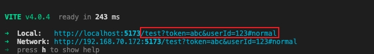

# vite-plugin-dev-url

A vite plugin to reset vite development server address, including path, search, and hash



[中文文档](https://github.com/xiaweiss/vite-plugin-ali-oss/blob/master/README_CN.md)
## Install
```bash
npm i -D vite-plugin-dev-url
```
Add plugin to your `vite.config.ts`:
```ts
// vite.config.ts
import vitePluginDevUrl from 'vite-plugin-dev-url'

export default {
  plugins: [
    vitePluginDevUrl({ query: { token: 'abc', userId: 123 }, path: '/test', hash: '#normal' })
  ],
  server: {
    host: "0.0.0.0",
  },
}
```
## Query asynchronous method

```ts
// vite.config.ts
import vitePluginDevUrl from 'vite-plugin-dev-url'

export default {
  plugins: [
    vitePluginDevUrl({ query: () => {
        return new Promise((resolve, reject) => {
          setTimeout(() => {
            resolve({ psToken: 'abc', psUserId: 123 })
          }, 1e3)
        })
      }, path: '/promise', hash: '#ps'
    })
  ],
  server: {
    host: "0.0.0.0",
  },
}
```
## options
| options| description                                                                          | type                | default |
|--------|------------------------------------------------------------------------------------- |---------------------|---------|
| open   | The application automatically opens in the browser when the developmentserver starts | boolean             | false   |
| query  | The query of the url                                                                 | object or function  | {}      |
| path   | The path of the url                                                                  | string              | ''      |
| hash   | The hash of the url                                                                  | string              | ''      |